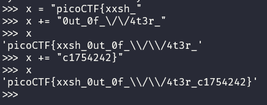

# Challenge: Magikarp Ground Mission - 30p

## Description
Do you know how to move between directories and read files in the shell? Start the container, `ssh` to it, and then `ls` once connected to begin. Login via `ssh` as `ctf-player` with the password, `b60940ca`

Additional details will be available after launching your challenge instance.

## Process
The flag in this challenge is divided across multiple files. By using ``ls`` I noticed that there's a txt file called *1of3.flag.txt*. I then typed in cat ``1of3.flag.txt`` which gave me the first part of the flag (*picoCTF{xxsh_*). Knowing that there were going to be three parts to this flag I decided to open a seperate terminal window running python and saving the first part to a variable ``x`` which I could easily add the following parts of the flag to.

Next, I opened up ``instructions-to-2of3.txt`` using cat in the same directory. It contained the following text:

*"Next, go to the root of all things, more succinctly `/`"*

So the next thing I did was ``cd /`` which sent me to the root directory. Running ``ls`` here presented me with a plethora of files and directories. One being *2of3.flag.txt* as well as *instructions-to-3of3.txt*. Similarly to before, I used ``cat 2of3.flag.txt`` which gave me the second part of the flag (*0ut_0f_\/\/4t3r_*). Next up, I ran ``cat instructions-to-3of3.txt`` which contained the following text:

*"Lastly, ctf-player, go home... more succinctly `~`"*

I ran ``cd ~`` and then ``ls`` which presented me with the file ``3of3.flag.txt``. Using ``cat`` I found the contents of the file (*c1754242}*). Adding all of these to the variable x in the python tab of my terminal we got the flag.

