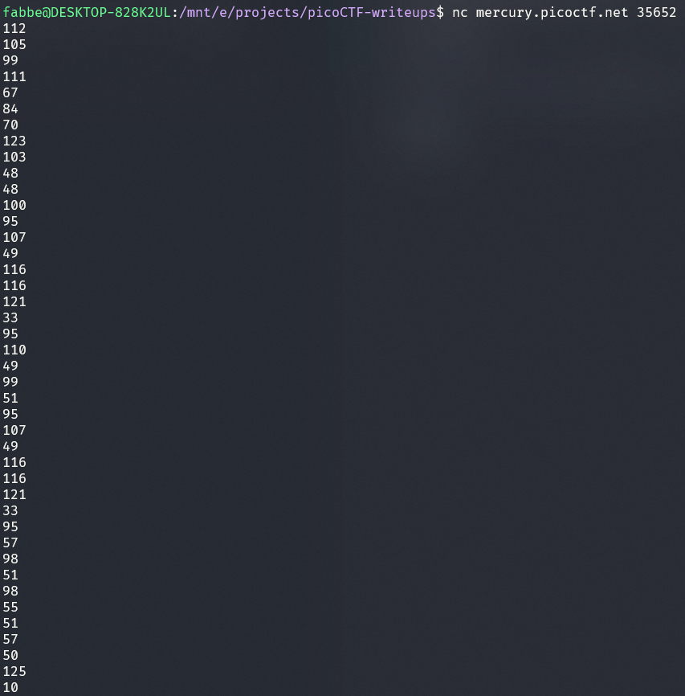

# Challenge: Nice netcat... - 15p

## Description
There is a nice program that you can talk to by using this command in a shell: $ nc mercury.picoctf.net 35652, but it doesn't speak English...

## Process

I pasted the netcat command in my terminal and got the following output:

These are ASCII numbers and can be converted through online converters or you could make a simple script that converts them. I ran these numbers through an online converter and got the correct flag.