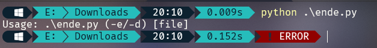

# Challenge: Python Wrangling - 10p

## Description
Python scripts are invoked kind of like programs in the Terminal... Can you run this Python script using this password to get the flag?

## Process
I began by downloading all of the provided files. This includes, the python decryption script, the password as well as the flag in an encrypted format. I began by running the python script without providing any arguments. This presented me with the following:

From this, I assumed that ``-e`` would stand for encryption whereas ``-d`` would stand for decryption. I decided to use ``-d`` along with the path to the encrypted flag file and got the following:

I entered the given password and found the flag.

