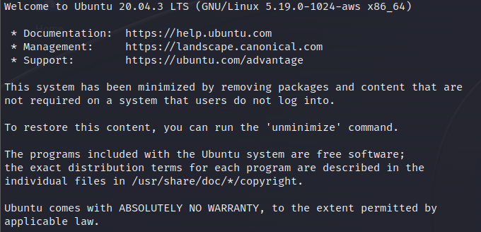

# Challenge: Special - 300p

## Description
Don't power users get tired of making spelling mistakes in the shell? Not anymore! Enter Special, the Spell Checked Interface for Affecting Linux. Now, every word is properly spelled and capitalized... automatically and behind-the-scenes! Be the first to test Special in beta, and feel free to tell us all about how Special streamlines every development process that you face. When your co-workers see your amazing shell interface, just tell them: That's Special (TM) Start your instance to see connection details.

Additional details will be available after launching your challenge instance.

## Initial thoughts
While reading the challenge description, I noticed that one sentence stood out from the rest. The sentence *"Now, every word is properly spelled and capitalized... automatically and behind-the-scenes!"* made me believe that Special is a <u>**restricted**</u> bash environment. Perhaps we will need to find means to bypass some of these restrictions in order to obtain the flag.

## Process
I began by launching the given instance with ssh. By doing this, I got greeted with the following text:

After this, we are thrown directly into the Special interface.