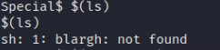
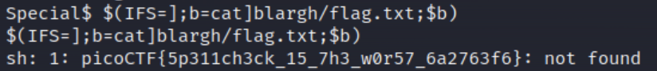

# Challenge: Special - 300p

## Description
Don't power users get tired of making spelling mistakes in the shell? Not anymore! Enter Special, the Spell Checked Interface for Affecting Linux. Now, every word is properly spelled and capitalized... automatically and behind-the-scenes! Be the first to test Special in beta, and feel free to tell us all about how Special streamlines every development process that you face. When your co-workers see your amazing shell interface, just tell them: That's Special (TM) Start your instance to see connection details.

Additional details will be available after launching your challenge instance.

## Initial thoughts
While reading the challenge description, I noticed that one sentence stood out from the rest. The sentence *"Now, every word is properly spelled and capitalized... automatically and behind-the-scenes!"* made me believe that Special is a <u>**restricted**</u> bash environment. Perhaps we will need to find means to bypass some of these restrictions in order to obtain the flag.

## Process
I began by launching the given instance with ssh. By doing this, I got greeted with the following text:

After this, we are thrown directly into the Special interface.

Given no further hints, I decided on trying a bunch of different linux shell commands to see how the Special interface would react. I quickly realized that it would autocorrect the commands to non-valid ones. A good example of this is that `ls` would turn into `Is` which of course is not a valid command.

One way I could essentially force some of the functionality of `ls` would be to wrap it within `$()`. By running `$(ls)` the shell will use the output of the `ls` command and substitute it for your input. An example of this would be that if you run `ls` and the output is `file1.txt file2.txt directory1/ directory2/` but if you run `$(ls)` it'd be as if you ran `file1.txt file2.txt directory1/ directory2/`.

In our case, by running `$(ls)` we get the following:

As per our explanation of `$(ls)`, this must mean that there is a directory called *blargh*. The next logical step would be to see what is beyond this directory so I called `$(ls blargh)`.

By calling this command, you get a somewhat unexpected syntax error. By messing around with a few other commands I found that the Special interface did not allow for commands to be seperated by a space.

Although this part ended up being quite a thinker for me, I eventually stumbled upon a [website](https://book.hacktricks.xyz/linux-hardening/bypass-bash-restrictions#bypass-forbidden-spaces) explaining how one could bypass forbidden spaces in Bash. This was done by modifying the internal field separator (IFS) which is the variable that defines the character(s) used to seperate a pattern into tokens. Following the website guide, I decided upon changing it from space to `]`. 

By running `$(IFS=];b=ls]blargh;$b)` I got the output `flag.txt not found`. This seems promising. Since there is a flag.txt file in the blargh directory I decided upon modifying the previous command slightly in order to access this txt file.

Using cat we run `$(IFS=];b=cat]blargh/flag.txt;$b)` which finally gave us the flag 

