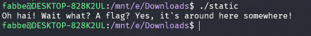
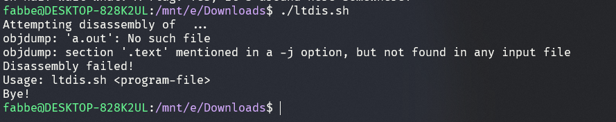
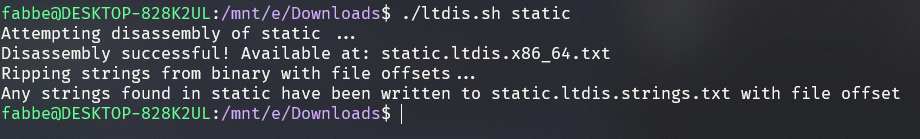
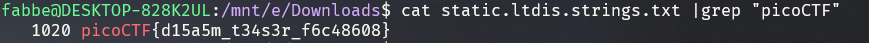

# Challenge: Static ain't always noise - 20p

## Description
Can you look at the data in this binary: static? This BASH script might help!

## Process

I began by running the static as is with no arguments.

Next, I decided to run the bash file with no arguments.

This created an empty ``.txt`` file. Since the output said *"Attempting disassembly of ..."* made me believe that you need to supply the bash file with an argument which it could disassemble. I gave the static as an argument and got the following:

This created 2 files, *static.ltdis.x86_64.txt* as well as *static.ltdis.strings.txt*. The output also states that all of the strings which the static contained were written to the latter txt file. Since the flag is a string it most likely ended up in this file. In order to find the flag, I decided to query for the picoCTF keyword by running ``cat static.ltdis.strings.txt |grep "picoCTF"`` which gave me the flag.

