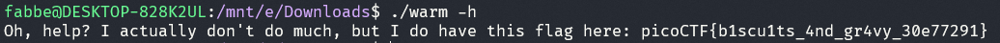

# Challenge: Wave a flag - 10p

## Description
Can you invoke help flags for a tool or binary? This program has extraordinarily helpful information...

## Process
I started off by running the file through the terminal and got the following:

I ran the same command again except this time I passed in ``-h`` which gave me the flag.

