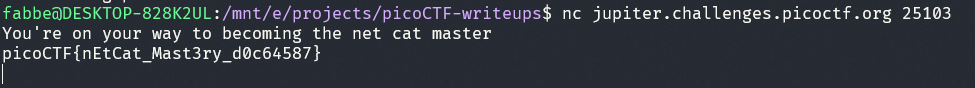

# Challenge: what's a net cat? - 100p

## Description
Using netcat (nc) is going to be pretty important. Can you connect to jupiter.challenges.picoctf.org at port 25103 to get the flag?

## Process
Running nc ``jupiter.challenges.picoctf.org 25103`` gives the following output which contains the flag:

